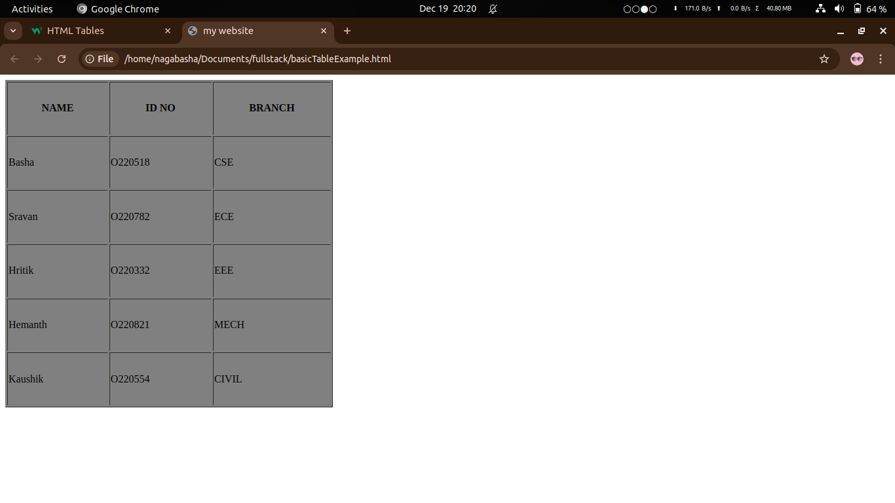
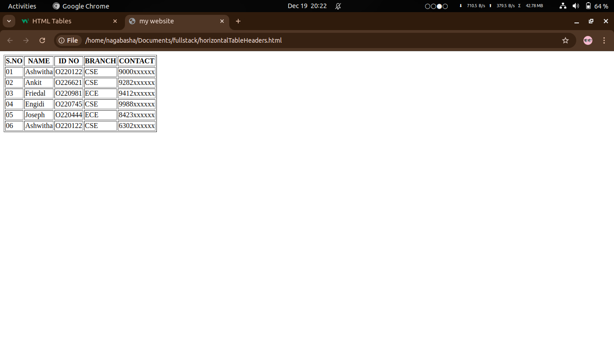
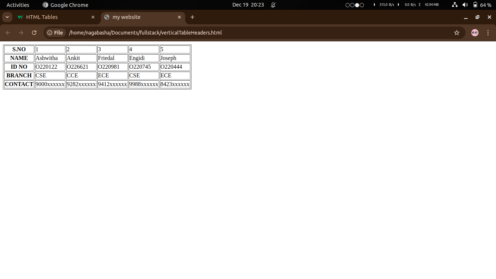
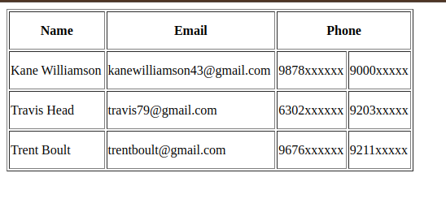
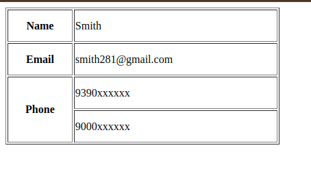

<h1>TABLES IN HTML</h1>
<ul>
  <li>Tables in a webpage plays a major role,tables are useful to arrange the particular data linearly</li>
  <li>Tables in html are created by using the <code>&LTtable></code> element</li>
  <li><code>syntax:- &LTtable>---table---&LT/table></code></li>
  <li>There are 5 major things are there in HTML tables</li>
  <ol type="1">
    <li>CRAETING A TABLE ROWS AND CELLS</li>
    <li>CREATING TABLE HEADERS (VERTICAL & HORIZONTAL)</li>
    <li>MERGING ROWS AND COLS</li>
    <li>TABLE PADDING AND SPACING</li>
    <li>TABLE STYLING</li>
  </ol>
  <li></li>
</ul>

<h1>1.CREATING A TABLE ROWS AND CELLS</h1>
<ul>
  <li>To create a table row we can use the <code>&LTtr></code> tag</li>
  <li>Inside the table row we can create the table cells, that can be done by using the <code>&LTtd></code> tag</li>
  <li>By using the above two tags we can create the entire table in HTML</li>
</ul>
<h4>example:</h4>
<pre>
  &LT!DOCTYPE html>
  &LThtml>
    &LThead>
      &LTtitle>my website&LT/title>
    &LT/head>
    &LTbody>
    &LTtable border="1"><code>---------------------------------------------------------------->table_starting</code>
      &LTtr><code>----------------------------------------->row1_starting</code>
        &LTtd>NAME&LT/td><code>-------------->indicates row1 col1 cell</code>
        &LTtd>BRANCH&LT/td><code>------------>indicates row1 col2 cell</code>
        &LTtd>ID NO&LT/td><code>------------->indicates row1 col3 cell</code>
      &LT/tr><code>---------------------------------------->row1_ending</code>
      &LTtr>
       &LTtd>HRITIK&LT/td>
       &LTtd>CSE&LT/td>
       &LTtd>O220518&LT/td>
      &LT/tr>
      &LTtr>
       &LTtd>NITESH&LT/td>
       &LTtd>ESE&LT/td>
       &LTtd>O220224&LT/td>
      &LT/tr>
      &LTtr>
       &LTtd>KOUSHIK&LT/td>
       &LTtd>EEE&LT/td>
       &LTtd>O220897&LT/td>
      &LT/tr>
    &LT/table><code>---------------------------------------------------------------------------->table_ending</code>
     &LT/body>
  &LT/html>
</pre>

<h4>output:</h4>
  <!DOCTYPE html>
  <html>
    <body>
    <table border="1">
      <tr>
        <td>NAME</td>
        <td>BRANCH</td>
        <td>ID NO</td>
      </tr>
      <tr>
       <td>HRITIK</td>
       <td>CSE</td>
       <td>O220518</td>
      </tr>
      <tr>
       <td>NITESH</td>
       <td>ESE</td>
       <td>O220224</td>
      </tr>
      <tr>
       <td>KOUSHIK</td>
       <td>EEE</td>
       <td>O220897</td>
      </tr>
    </table>
     </body>
  </html>

<ul>
  <li>In the above example, we have used <code>border</code> . This is a attribute used in table start_tag.</li>
  <li><code>border</code> attribute is used to apply the borders(outlines) for the entire table.</li>
  <li><code>syntax:- &LTtable border="value" >; value= either 0 or greater than 0 (by default it will be 0)</code></li>
  <li>If you increase the value then,the size of the border of a table also increases</li>
</ul>

<h1>1.CREATING A TABLE HEADERS (VERTICALLY & HORIZONTALLY)</h1>
<ul>
  <li>To create a table headings we can use the <code>&LTth></code> tag</li>
  <li><code>&LTth></code> stands for <b>"table heading"</b></li>
  <li><code>syntax:-&LTth>--table_heading--&LT/th></code></li>
  <li>Whatever the data(heading) you have written between the <code>&LTth> and &LT/th></code> that data will be appears boldly(thick or darkly) in the output so that we can easily differentiate the table headings from the table data</li>
  <li>Generally,table headings are written in the top most of the table cells(table columns) or sometimes it may written in the side most cells(table rows)of the table.</li>
  <li>Writing headings in the top most table cells is called the <b>"HORIZONTAL TABLE HEADERS"</b></li>
  <li>Writing headings in the side most of the table cells is called the <b>"VERTICAL TABLE HEADERS"</b></li>
</ul>
<h4>example for a basic table:-</h4>

<h4>example for a Horizontal header table:-</h4>

<h4>example for a vertical header table:-</h4>

<h1>3.MERGING ROWS AND COLS</h1>
<ul>
  <li>Sometimes we need to merge some rows,cols and cells</li>
  <li>This can be done by using the <code>rowspan</code> and <code>colspan</code> attributes. these attributes are used in the starting tags of <code>&LTth></code> or <code>&LTtd></code></li>
  <li>To make a cell span over multiple columns, we use the <code>colspan</code> attribute</li>
  <li><code>syntax:- &LTtd colspan="no.of_cols_you_have_to_span/merge"></code></li>
  <li>To make a cell span over multiple rows, we use the <code>rowspan</code> attribute</li>
  <li><code>syntax:- &LTtd rowspan="no.of_rows_you_have_to_span/merge"></code></li>
  <li>you have to be careful while merging/spanning the rows or columns because, sometimes you need to delete a row or col while you are merging a row/col. so, remind this point </li>
  <li>You can merge no.of rows and cols at a time no limitations is there.</li>
</ul>
<h4>example for a colspan or merging of two columns</h4>

<h4>example for a rowspan or merging of two columns</h4>

